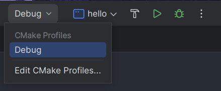
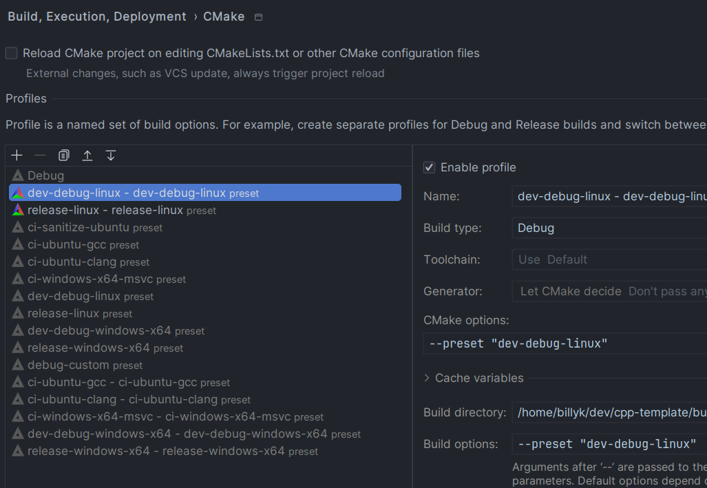
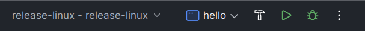
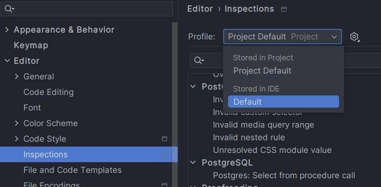
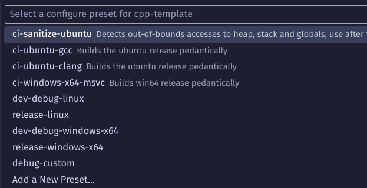
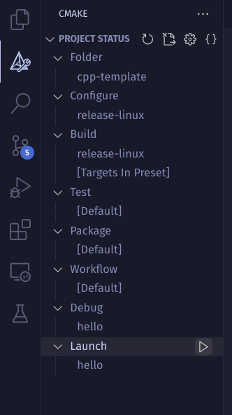
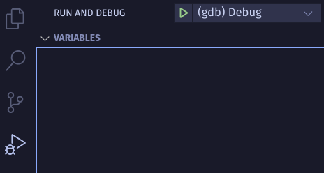

# Setup Guide

This document explains how to set up developer environment, compile and debug the project on *Linux* (mostly Debian
based, but the guide is descriptive enough to successfully apply it on other distributions) and *Windows* with *CLion*
or *VS Code*.

Because of the popularity regardless of the user platform, *CLion* and *VS Code* are especially supported by including
`.idea/*` and `.vscode/*` configurations in the repository source control. If you are wondering which one to choose, we
suggest trying both and see which works best for you, but it's worth noting that *CLion* provide additional bug checks (
memory leaks and more) via built-in `ReSharper` tool that are out of the scope of the `clang-tidy` checks.

The repository is based on the *CMake* cross-platform build system and uses *clang-tidy* and *clang-format* to assert
code quality and force consistent code style among developers.
For that reason, any IDE that provides support for these tools should allow decent
programming experience. As *clangd* is configured, it's also possible to use any text editor e.g. Neovim, that is
supported by [clangd plugin](https://clangd.llvm.org/installation#editor-plugins), which provides clang-tidy warnings
and compile errors as you type.

> **_NOTE:_**  The `.clangd` file is automatically generated by CMake during the configuration step to standardize 
> the *clangd* configuration and prevent issues caused by differences between Windows and Unix systems. 
> You don't need to include it manually. If you prefer not to generate this file, you can disable it by 
> setting `GENERATE_CLANGD_FILE` to `OFF`. For details on creating a preset with this option, see 
> the *User Presets* section in the [Working with the Repository Guide](WorkingWithTheRepository.md).

## Preparing a platform

### Compiler and standard library

The repository is based on the `c++23` standard which at the moment requires the newest compiler version and standard
library associated with it. Recommended compilers are:

1. *GCC* (`=> 14.0`),
2. *Clang* (`=> 18.0`),
3. *MSVC* (`=> 19.41`).

#### Linux

Depending on your personal preference you may use either Clang or GCC.
Newest releases of some distributions e.g. Ubuntu 24.04 and Fedora 40 provide current versions of the tools via their
package managers:

```bash
# Ubuntu
sudo apt install gcc-14 g++-14
sudo apt install clang

# Fedora
sudo dnf install gcc
sudo dnf install clang 
```

##### Containerized linux environment

If you are using an older linux distribution release or a distribution that lacks the newest gcc or clang packages
(e.g. Debian), you may use [*distrobox*](https://distrobox.it/) to create your containerized environment.
See [the list](https://distrobox.it/#installation) of the distributions that provide *distrobox* in their
package managers and if it unavailable on your distribution, proceed
with the [script installation](https://distrobox.it/#alternative-methods).

When installed run

```bash
distrobox create --image ubuntu:24.04 --name ubuntu24
```

to create the 24.04 ubuntu image. Then you can enter it with

```bash
distrobox enter ubuntu24
```

When you are in the container, your host `$HOME` directory is mounted as container's home, so all the programs you
use
will have their configuration files available. However since the `root` directory of the entered container is different
from your host's (that's the point), all the packages installed on your host system are unavailable (including VS Code,
git, cmake, etc.) and you should install them manually (e.g. via package manager).

Now you can install the newest gcc and/or clang. Remember that in the next steps and before running *VS Code*/*CLion*,
you
need to enter the distrobox first.

##### [?] Clang precompiled binaries

Another approach for unavailable newest compiler versions
are [precompiled binaries](https://github.com/llvm/llvm-project/releases/tag/llvmorg-18.1.8) offered by clang (only),
you may use [this tutorial](https://apetenchea.github.io/2021/10/17/installing-prebuilt-binaries-in-ubuntu/) to set it
up.

#### Windows

To install the newest version of MSVC or Clang (we recommend MSVC), download the community version of
[Visual Studio 2022 installer](https://visualstudio.microsoft.com/downloads/) and follow
[this microsoft guide](https://learn.microsoft.com/en-us/cpp/build/vscpp-step-0-installation?view=msvc-170#step-3---install-the-visual-studio-installer).

### Python and jinja2

In order to generate `gl.h` header depending on the operating system and available drivers we
use GLAD which is one of the
available [OpenGL Loading Libraries](https://www.khronos.org/opengl/wiki/OpenGL_Loading_Library). When
the project
is being built, GLAD is invoked to generate the required files. Then CMake makes them available for our project, so
they are built and linked properly.

GLAD is written in *python3* and depends on the *jinja2* module, so you need to make them available on your computer.

#### Linux

Use package manager to install python3 and jinja2

```bash
# Debian/Ubuntu
sudo apt install python3 python3-jinja2
```

#### Windows

Open powershell and install python3 with

```pwsh
winget install -e --id Python.Python.3.12 --scope machine
```

When installation is finished, run

```pwsh
python -m pip install jinja2
```

to install the *jinja2* module.

### Wayland and X11 dev libraries (Linux only)

By default, GLFW requires X11 and Wayland dev libraries in order to compile. To install all of these dependencies, use
package manager:

```bash
# Debian/Ubuntu
sudo apt install libwayland-dev libxkbcommon-dev xorg-dev
```

If you are not a Debian-based distribution user, you may
follow [the GLFW documentation](https://www.glfw.org/docs/3.3/compile.html#compile_deps).

If you want to compile only X11 or only Wayland you can adjust `GLFW_BUILD_X11` and `GLFW_BUILD_WAYLAND` cmake
variables and install dev libraries only for one of them. This will be outlined in
the [Working With The Repository](WorkingWithTheRepository.md) guide.

## *CLion* Setup

### Installation

*CLion* comes with the newest version of the precompiled binaries of `clangd`, `clang-tidy`, `clang-format`, `gdb`,
`lldb`, `ninja` and `cmake`, which means that you don't need
to install any of them manually on your platform. Note that
it DOES NOT come with the compiler and tools/libraries
that are mentioned in the previous sections.

#### Linux

You may use precompiled binaries from [here](https://www.jetbrains.com/clion/download/#section=linux). It's also
possible to use [flatpak](https://flathub.org/apps/com.jetbrains.CLion) or [snap](https://snapcraft.io/clion)
if you prefer, but note that if you are using *distrobox*, you need to install them inside your container.

If you've chosen to download the compiled binary files, after extracting the *CLion* you can run
it with `./Clion-<year>.<version>/clion-<year>.<version>/bin/clion`. For convenience of usage you can move the
`clion-<year>.<version>` folder either into `/usr/local/` or somewhere in your `$HOME`, e.g. `~/.software` (if there is
no such folder then create it) -- it's up to you. To make it available in your system via an icon you can use `alacarte`
on *Gnome* or `kmenuedit` on *KDE Plasma* to provide the path to the executable and icon.

If you use the *distrobox* with the precompiled binaries on linux remember to make the executable available on your
container,
not the host machine. To achieve this you can move the `clion-<year>.<version>` folder into `~/.software`, then
create a simple bash script and place it in the *CLion* `~/.software/clion-<year>.<version>/bin` directory to automate
the
process of entering the *distrobox* and running the *CLion*:

```bash
#!/usr/bin/env bash
SCRIPT_DIR=$( cd -- "$( dirname -- "${BASH_SOURCE[0]}" )" &> /dev/null && pwd )

distrobox enter ubuntu24 -- $SCRIPT_DIR/clion
```

Now the script may be added as an executable to the `alacarte` or `kmenuedit` instead of the binary, so that when
you click on the icon the script will run instead.

#### Windows

Download *CLion* installer from [this page](https://www.jetbrains.com/clion/download/#section=windows), run it and
follow the instructions.

### Running the repository with CLion

When the repository is entered via *CLion* for the first time, you should be welcomed with the
`Build, Execution, Deployment > CMake` window that displays the `Profiles` section.

If the window doesn't appear, that means that you need to load the CMake Project manually. To do so, right-click on the 
root directory level `CMakeLists.txt` and choose `Load CMake Project`. Apart from finding the preset, this will 
automatically start configuring and building the project (`cmake-build-(release|debug)` directory), 
which may fail, because the preset is not yet chosen and the CLion defaults are used instead. To navigate 
to the profiles window, show more options by clicking the `Debug` in the top right corner and click on 
`Edit CMake Profiles...`.



In the Profiles section, go to the following profiles:
- `dev-debug-(windows-x64|linux) - dev-debug-(windows-x64|linux)`,
- `release-(windows-x64|linux) - release-(windows-x64|linux)`

and select `Enable profile` for each of
them. Click `Apply` button and close the window, *CLion* will index the files and run the cmake configuration
basing on one of the chosen presets that may be seen in the top-right corner.



It’s important to understand the distinction between a preset and a profile:
- *Preset*: A preset is declared in `CMakePresets.json` file and defines a 
set of variables and options used by the cmake command. There are two types of presets:
  - *Configure Preset*: Applied during the CMake's configuration stage, invoked with `cmake --preset=release-linux`.
  - *Build Preset*: Applied during the CMake's build stage, invoked with `cmake --build --preset=release-linux`.
- *Profile*: A profile represents the complete configuration and build pipeline. 
Profiles are typically named using either the format 
`configure-preset-name` or `configure-preset-name - build-preset-name`. The former profile indicates that CMake 
used the specified configure preset and generated the build stage automatically, while the latter (preferred) 
uses both configure and build presets.

After cmake configuration finishes, you should be able to
compile the project using the `Run` button. If you wish to run debugging make sure to select `dev-debug` preset, e.g.
`dev-debug-linux` first, then you can start debugging by using the `Debug` button.



Since the repository controls the source of project-specific *CLion* settings in `.idea` folder, when doing any settings
configuration, please make sure to select `Profile -> Default` in order to avoid modifying the source
controlled content of `.idea`. If you think that some option should be project specific please explicitly explain this
in your PR.



## *VS Code* Setup

### Installation

Download *VS Code* from [the download side](https://code.visualstudio.com/Download) and install it on your machine.

#### Containerized Linux environment (distrobox)

If you are using *distrobox* install the VS Code in your container:

```bash
distrobox enter ubuntu24
sudo dpkg -i <path-to-deb-file>
```

To enter the vscode in your containerized environment when you are not already in the container use

```bash
distrobox enter ubuntu24 -- code
```

You may provide this command to `alacarte` on *Gnome* or `kmenuedit` on *KDE Plasma* and create an icon shortcut.

#### Developer tools

Unlike *CLion*, *VS Code* does not provide all the developer tools out of the box and some of them need to be installed
before installing the extensions. This includes *CMake*, *ninja* on both platforms and additionally *gdb* on Linux.

##### Linux

Install *CMake* (`>=3.20`), *ninja*, and *gdb* (if you use *distrobox*, remember to enter the
container first) via package manager:

```bash
# Debian/Ubuntu
sudo apt install cmake ninja gdb
```

##### Windows

Use `chocolatey` ([chocolatey installation guide](https://chocolatey.org/install#generic)) package manager, open your
powershell and type

```pwsh
choco install ninja
choco install cmake 
```

#### Extensions

In your vscode install the following extensions:

- `ms-vscode.cmake-tools`: Provides convenient CMake-based project workflow, requires *CMake* to be installed on your
  computer.
- `llvm-vs-code-extensions.vscode-clangd`: Installs *clangd*, *clang-tidy* and *clang-format*. Provides clangd plugin to
  your *VS Code* editor that communicates with *clangd* server running on your machine nad provides autocompletion,
  compilation errors, clang-tidy warnings and clang-format formatting.
- `twxs.cmake`: Provides autocompletion and colorization in *CMake* files.
- `cheshirekow.cmake-format` (optional): requires `cmake-format` to be installed on your machine via *pip*. Provides
  *CMake* files formatting.
- `ms-vscode.cpptools`: Provides cpp debugging support.

### Running the repository with *VS Code*

When the repository is entered via CLion for the first time, you should be prompted by `ms-vscode.cmake-tools` extension
to choose your current configure preset choose one of the debug presets that suits your platform e.g. `dev-debug-linux`. You can
change the preset later, using the command palette (`Ctrl`+`Shift`+`P`) and running `CMake: Select Configure Preset`.



Open command palette again, and find `CMake: Select Build Preset`, then select the build preset that has the same name
as the chosen configure preset.

*VS Code* will automatically start configuring the *CMake*. When it's done you can navigate to the *CMake* bookmark on
the left panel and click on `Launch` in order to compile and run the project.



If you wish to run debugging make sure to select `debug` preset (both build and configure), e.g. `dev-debug-linux` first, 
then you can start debugging by either running the `Debug` in the *CMake* panel or by navigating to
`Run and Debug` selecting `(gdb) Debug` on Linux or `(msvc) Debug` on Windows.



## Known issues

### Windows ModuleNotFoundError: No module named 'jinja2'

If you encounter `ModuleNotFoundError: No module named 'jinja2'` problem, scroll the CMake configuration
messages and find `Found Python: ...` message. Copy the python3 path that has been found by the CMake and in your
*pwsh* run

```pwsh
<path> -m pip install jinja2
```

### #include <glad/gl.h> is not recognized by the IDE 

GLAD files need to be generated first. Unfortunately, at the moment the generation process 
takes place during the build phase, which means that you need to build the repository first using the `dev-debug-(windows-x64|linux)` preset and refresh the IDE.
