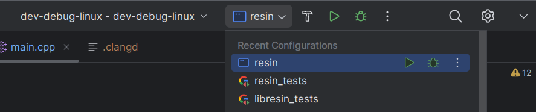
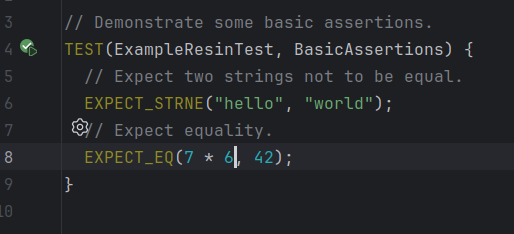

# Working with the Repository Guide

## C++ Projects Structure

Our repository consists of two projects:

1. `libresin`: a library which provides backend for the application,
2. `resin`: an executable which is the frontend of our application.

Each of these projects follows the
[`Canonical Project Structure`](https://www.open-std.org/jtc1/sc22/wg21/docs/papers/2018/p1204r0.html):

1. No `include/` and `src/` split.
2. All headers are included with `<>` and should follow the project name as directory prefix,  e.g. `<libhello/hello.hpp>`.
3. The project's source directory can have subdirectories of its own to organize the code into components e.g. `<libhello/core/hello.hpp>`.
4. Header and source files extensions are respectively `.hpp` and `.cpp`.
5. No special characters other than `_` and `-` in the file and directories names. In our project we follow the `snake_case` as specified in [Google's cpp guide](https://google.github.io/styleguide/cppguide.html#File_Names).

### Adding new files

To add a new file place it in the correct folder and add the file to the `CMake` into
`add_(library|executable)` function:

```cmake
# libresin/CMakeLists.txt
add_library(${PROJECT_NAME} libresin/resin.cpp libresin/resin.hpp)

# resin/CMakeLists.txt
add_executable(${PROJECT_NAME} resin/main.cpp)
```

Without this step CMake will not recognize the files and the building process will fail.

### Adding unit tests

All `resin` and `libresin` tests must be placed into `resin/tests` and `libresin/tests` respectively. The `tests/`
folder structure must mirror the `resin/resin` or `libresin/libresin` folder structure. After creating the files,
analogously to the default cpp files you must add them to `add_executable` in proper CMake file.

```cmake
# libresin/CMakeLists.txt or resin/CMakeLists.txt
if(BUILD_TESTING)
  # ...

  add_executable(
    "${PROJECT_NAME}_tests"
    tests/example_test.cpp
  )

  # ...
endif()
```

## Unit testing

### VS Code

After adding new tests to an existing test file refresh the tests with `CMake: Refresh` and run them with
`CMake: Run Tests` or `Test: Run All Tests`. You may also use `Testing` section to run the tests.

When adding new test file to the CMake you need to additionally reconfigure the project using `CMake: Configure`, which
normally happens automatically.

### CLion

To run tests you can use test configuration



or navigate to the test file in order to run single test



## CMakePresets

*CMake* presets allows for sharing settings with other people for common ways to configure a project. In
*CMake* presets you can specify a value for variables that are passed to the build system. This way there is no need to
provide them manually each time the *CMake* is invoked.

You can learn more about the CMakePresets [here](https://cmake.org/cmake/help/latest/manual/cmake-presets.7.html).

*CMake* presets are extensively used in the repository for providing the CI settings and developer settings. This way
we can ensure that each developer runs compiler with the same set of flags without depending on the IDE configurations.
There are 2 types of CMake presets used in the repository:

- *Configure Preset*: Applied during the CMake's configuration stage, invoked with `cmake --preset=release-linux`,
- *Build Preset*: Applied during the CMake's build stage, invoked with `cmake --build --preset=release-linux`.

It's a good practice to use combination of both `configure` and `build` during the development, see the *VS Code* and
*CLion* setup in the [Setup Guide](SetupGuide.md).

The rule of thumb is that during the development you should use `dev-debug-linux` or `dev-debug-windows-x64` in
order to run and debug. When you want to simply compile and run the optimal versions of the binaries, you should use
`release-linux` or `release-windows`.

### User Presets

As a developer you may want to provide additional *CMake* variables to some presets, e.g. `CMAKE_CXX_COMPILER`,
`Python_EXECUTABLE` or `GLFW_BUILD_WAYLAND`. To do so do not modify `CMakePresets.json`. Instead, you can create
`CMakeUserPresets.json` that is excluded from the source control. This file automatically includes all presets from
`CMakePresets.json` so you can create your own preset by inheriting from the already created presets.

Here is an example of a preset that inherits from `dev-debug-linux` and sets some *CMake* variables:

```json
{
  "version": 6,
  "cmakeMinimumRequired": {
    "major": 3,
    "minor": 20,
    "patch": 0
  },
  "configurePresets": [
    {
      "name": "dev-debug-custom",
      "inherits": [
        "dev-debug-linux"
      ],
      "cacheVariables": {
        "CMAKE_CXX_COMPILER": "/usr/bin/g++-14",
        "CMAKE_C_COMPILER": "/usr/bin/gcc-14",
        "GLFW_BUILD_WAYLAND": "OFF",
        "GLFW_BUILD_X11": "ON",
        "GENERATE_CLANGD_FILE": "OFF"
      }
    }
  ], 
  "buildPresets": [
    {
      "name": "dev-debug-custom",
      "configurePreset": "dev-debug-custom",
      "configuration": "Debug"
    },
  ]
}
```
